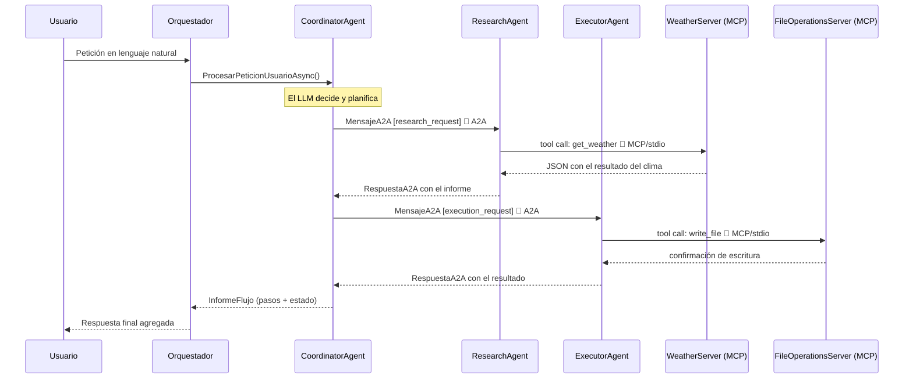

# 🔍 Probar un servidor MCP de forma independiente — MCP Inspector

> [!abstract] Objetivo de esta guía
> Aprender a **arrancar y probar un servidor MCP por separado**, sin agentes ni modelos de lenguaje de por medio, usando la herramienta oficial **MCP Inspector**. Es la mejor forma de entender qué expone un servidor y de depurar sus herramientas de forma aislada.

---

## 🧭 Antes de empezar: ¿cómo se comunican los 3 proyectos?

La solución combina **dos protocolos distintos** que cumplen roles diferentes. Entenderlos es clave para saber qué estamos probando.

```
Scenario1.slnx
├── McpServers/
│   ├── Scenario1.WeatherServer         ← Servidor MCP #1 (clima)
│   └── Scenario1.FileOperationsServer  ← Servidor MCP #2 (archivos)
└── Scenario1.Host                      ← Host con 3 agentes + orquestador A2A
```

| Protocolo | Quién lo usa | Transporte | Naturaleza |
|---|---|---|---|
| **MCP** (Model Context Protocol) | Research y Executor → sus servidores | **stdio** (JSON-RPC sobre stdin/stdout) | El agente lanza el servidor como **subproceso** |
| **A2A** (Agent-to-Agent) | Coordinador → los otros dos agentes | Llamadas en proceso (in-process) | **Contrato de mensajes** (`MensajeA2A` / `RespuestaA2A`) |

> [!info] Dos protocolos, un objetivo
> **MCP** conecta un agente con sus *herramientas*. **A2A** conecta un agente con *otros agentes*. En este escenario el `CoordinatorAgent` **no usa MCP**: solo delega por A2A. Únicamente los agentes especializados (Research y Executor) abren sesiones MCP.

### Los servidores MCP en detalle

Los dos servidores **no son servicios web autónomos**: no escuchan en ningún puerto. Se lanzan como subprocesos mediante `StdioClientTransport` y exponen sus herramientas por JSON-RPC.

| Servidor | Herramientas que publica |
|---|---|
| **WeatherServer** | `get_weather`, `get_forecast`, `get_alerts` |
| **FileOperationsServer** | `read_file`, `write_file`, `list_files`, `delete_file`, `file_info` |

---

## 📡 Flujo de comunicación completo



> [!tip] Puntos clave del diagrama
> - **A2A es in-process:** llamadas directas entre objetos C# que implementan `IAgenteA2A`. No hay red HTTP; el "protocolo" es un contrato de mensajes tipado.
> - **MCP usa stdio:** el agente lanza el servidor como subproceso y habla JSON-RPC por stdin/stdout.
> - **El Coordinador solo delega:** no tiene sesiones MCP; los servidores los abren Research y Executor.
> - **El Orquestador solo habla con el Coordinador,** nunca con los especializados. Ese es el patrón A2A.

---

## 🔬 ¿Qué es MCP Inspector y por qué usarlo?

**MCP Inspector** es la herramienta oficial del proyecto Model Context Protocol para **inspeccionar y probar servidores MCP de forma interactiva**, sin necesidad de conectar un agente ni gastar tokens de ningún modelo.

> [!question] ¿Por qué probar el servidor por separado?
> Un servidor MCP es **código normal**: no necesita IA para funcionar. Probarlo aislado te permite:
> - Ver **exactamente** qué herramientas publica y con qué esquema.
> - Ejecutar cada herramienta **a mano** y validar su respuesta.
> - Depurar errores sin el ruido de un modelo de lenguaje decidiendo por el medio.
> - Confirmar el **handshake MCP** (`initialize` → `tools/list`) paso a paso.

---

## ✅ Evidencia: el servidor conectado en el Inspector

La siguiente captura muestra el **`file-operations-server` conectado y funcionando** en MCP Inspector v0.21.2. Se aprecian las cinco herramientas publicadas (con sus títulos y descripciones en español), el estado **Connected** y el historial de llamadas JSON-RPC.

![[MCPInspector.jpg]]

> [!success] Qué demuestra esta captura
> - **Panel izquierdo:** transporte `STDIO`, comando `dotnet`, estado 🟢 **Connected**, y el servidor identificado como `file-operations-server · Version: 1.0.0`.
> - **Panel central (Tools):** las 5 herramientas descubiertas **por protocolo** — *Listar archivos, Borrar archivo, Escribir archivo, Información de archivo, Leer archivo*. Esa lista **no está escrita en el Inspector**: llega desde el servidor.
> - **History (abajo):** la secuencia real del protocolo — `initialize`, `logging/setLevel`, `tools/list`. Es el handshake MCP ocurriendo de verdad.
> - **Descripciones en español:** confirman que los metadatos (`Title` y `Description`) del atributo `[McpServerTool]` viajan correctamente al cliente.

---

## 🚀 Cómo probarlo tú mismo

> [!warning] Requisito previo
> Ten instalado **Node.js** (para `npx`) y el **SDK de .NET 10**. El Inspector se ejecuta con `npx`, sin instalación permanente.

### Opción A · Con `dotnet run` (más simple)

El Inspector lanza el proyecto y hace el handshake por ti. Desde la raíz de la solución:

```powershell
npx @modelcontextprotocol/inspector dotnet run --project McpServers/Scenario1.FileOperationsServer
```

Se abrirá el navegador con la interfaz del Inspector, ya conectado.

### Opción B · Con la DLL ya compilada (más rápida)

Evita recompilar en cada arranque. **Primero compila una vez:**

```powershell
dotnet build
```

Y lanza el Inspector apuntando al DLL:

```powershell
npx @modelcontextprotocol/inspector dotnet "McpServers/Scenario1.FileOperationsServer/bin/Debug/net10.0/Scenario1.FileOperationsServer.dll"
```

### Para el servidor de clima

Cambia el proyecto o el DLL por el de clima:

```powershell
npx @modelcontextprotocol/inspector dotnet run --project McpServers/Scenario1.WeatherServer
```

---

## ⚙️ Configuración manual en la interfaz

Si prefieres arrancar el Inspector solo (`npx @modelcontextprotocol/inspector`) y configurar la conexión desde la UI, usa estos valores:

| Campo | Valor |
|---|---|
| **Transport Type** | `STDIO` |
| **Command** | `dotnet` |
| **Arguments** (opción A) | `run --project <ruta>/McpServers/Scenario1.FileOperationsServer` |
| **Arguments** (opción B) | `<ruta>/McpServers/Scenario1.FileOperationsServer/bin/Debug/net10.0/Scenario1.FileOperationsServer.dll` |

Luego pulsa **Connect** → el Inspector lanza el proceso y realiza el handshake MCP automáticamente.

> [!note] Sobre las rutas
> En los ejemplos se usan **rutas relativas a la raíz de la solución** (`scenario1_local_agents_CSharp/`). Si ejecutas el Inspector desde otra ubicación, usa la ruta absoluta completa hasta el proyecto o el DLL.

---

## 🧪 Qué hacer una vez conectado

Un recorrido sugerido dentro del Inspector:

1. **List Tools** → confirma que aparecen las 5 herramientas con sus descripciones.
2. Selecciona **Escribir archivo** (`write_file`), rellena `filename` y `content`, y ejecútala. Revisa que la respuesta llega como **objeto estructurado** (no como texto plano).
3. Ejecuta **Listar archivos** (`list_files`) y verifica que el archivo recién creado aparece, con el campo `total`.
4. Prueba **Leer archivo** (`read_file`) con un nombre inexistente → el servidor responde con un **error de herramienta** (`FileNotFoundException`), no con texto.
5. Fíjate en el panel **History**: cada acción tuya genera una llamada JSON-RPC que puedes desplegar y leer.

> [!tip] Prueba el guardián de seguridad
> Intenta leer `../../appsettings.json` desde el Inspector. El servidor debe **rechazarlo**: todas las rutas están confinadas al espacio de trabajo (`agent_workspace/`). Es una buena demostración del control anti-escape.

---

## 🧯 Problemas comunes

| Síntoma | Causa | Solución |
|---|---|---|
| El Inspector no conecta | La solución no está compilada (opción B) | Ejecuta `dotnet build` primero |
| `command not found: npx` | Falta Node.js | Instala Node.js (incluye `npx`) |
| Conecta pero no lista herramientas | Ruta del proyecto/DLL incorrecta | Verifica la ruta en **Arguments** |
| La conexión se corta al instante | Algo escribió en **stdout** del servidor | En stdio, **stdout es el canal JSON-RPC**: todo log debe ir a `stderr` |

> [!danger] La regla de oro de los servidores MCP stdio
> **Nunca escribas en `stdout`** desde un servidor stdio: ese canal es exclusivo del protocolo JSON-RPC. En este proyecto todo el logging se redirige a `stderr` (`LogToStandardErrorThreshold = LogLevel.Trace`) y los mensajes de arranque usan `Console.Error.WriteLine`. Un simple `Console.WriteLine` rompería la conexión con el Inspector.

---

## 🔗 Referencias

- Repositorio oficial: [github.com/modelcontextprotocol/inspector](https://github.com/modelcontextprotocol/inspector)
- Especificación de MCP: [modelcontextprotocol.io](https://modelcontextprotocol.io/)
- SDK de MCP para .NET: paquete NuGet `ModelContextProtocol`

---

<div align="center">

**Fernando Valdés H.** · *Magíster en Ingeniería en Informática*
Material didáctico sobre Microsoft Agent Framework, MCP y A2A — versión C# / .NET

</div>
